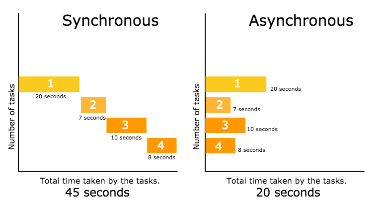

# Readme

## Outline

- Review
- Arrow Functions vs Function Declarations
- Functions vs Methods
- `fetch()` and Promises
- Running Servers

## Review

- Getting elements from the DOM
- Attaching elements to the DOM
- Listening to an event

- Task: Make the pokemon logo clickable. Once clicked, add the text "The logo has been clicked" in a "p" tag below the logo.

---

## Function Declarations vs Function Expressions (arrow functions)

```JavaScript
function myFunctionDeclaration(arg) {
	console.log(arg)
}

const myArrowFunction = (arg) => {console.log(arg)}
```

## Functions vs Methods

- Methods have a “receiver” while functions do not
- All methods are functions, but not all functions are methods

---

## `fetch()` and Promises

### Synchronous vs Asynchronous



- `fetch()` makes an asynchronous call to a url
- `fetch()` creates a type of object called a Promise
- The Promise object represents the eventual completion (or failure) of an asynchronous operation, and its resulting value. (https://developer.mozilla.org/en-US/docs/Web/JavaScript/Reference/Global_Objects/Promise)

## Running Servers

- In order to run the http server (front end server) you can run `python -m SimpleHTTPServer`
- To start our backend server run `json-server --watch db.json` (make sure json-server is installed `npm install -g json-server`)
